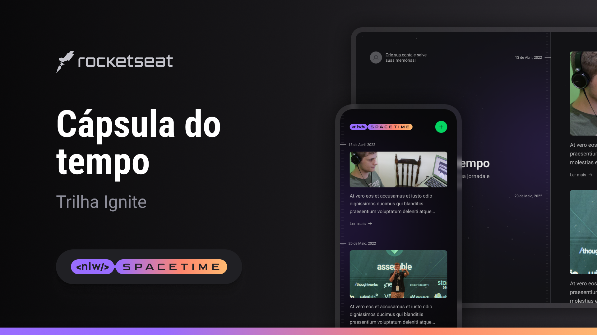

# **NLW Spacetime**

## 📲 Sobre o projeto
Essa é uma aplicação de cápsula do tempo. O usuário pode registrar suas memórias e consultar elas futuramente por meio de uma timeline organizada por mês e ano. 
## 🧠 Experiência
Foi uma semana de muito aprendizado, desenvolvendo o projeto de ponta a ponta.
Nesse projeto eu tive meu primeiro contato com back-end utilizando o Node compreendendo os motivos de utilizar uma linguagem com arquitetura single-threaded.

A partir disso encaixei estudos de back-end na minha rotina com o objetivo de me tornar um Desenvolvedor Full stack.
## 🚀 Tecnologias
**Front-end:**
- React | Typescript | Next | Axios | Tailwind

**Back-end:**
- Node | Prisma | Axios | SQLite | Fastify | Httpie | Typescript

**Mobile:**
- React Native | Expo | NativeWind | Typescript
## 🔗 Deploy
Ainda não está disponível.